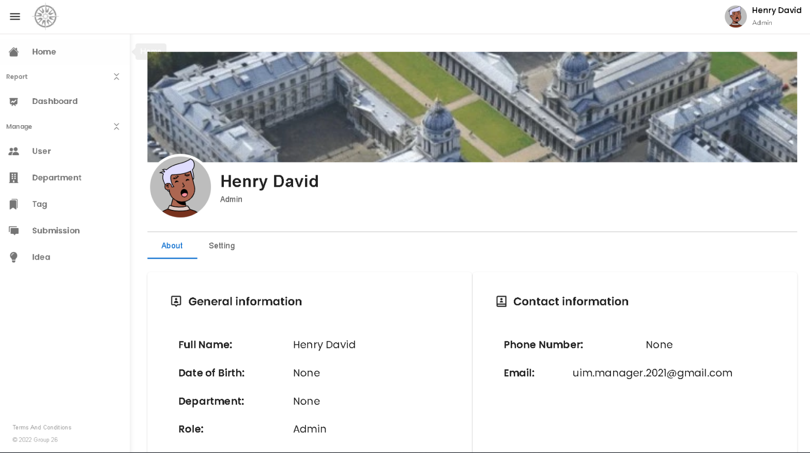

# University Idea Management (UIM)

UIM is a secure web-enabled role-based system to collect improvement ideas from staff members in a University.

## UIM Client [🔗](https://github.com/NGH14/university-idea-management-client/)

UIM Client is the Front-End of the University Idea Management system. 

### Features
- User authentication
- User management
- Idea submission and management by the department
- Commenting and discussion on ideas
- Upvoting and downvoting ideas
- Responsive design for desktop and mobile
- Utility pages:
  - Not found page (404)
  - Unauthorized page (401)
  - User profile
  - Terms and Conditions

### Technologies Used
- **Frontend Framework**: React (v17.0.2)
- **State Management**: Context API
- **UI Components**: MUI (v5.4.1)
- **API Integration**: Axios (v0.26.0)
- **Routing**: React Router (v6.2.1)
- **Styling**: CSS Modules
  
### Resources 
🔗 [Figma (_design by me_)](https://www.figma.com/design/PrvDwHZIg5nXfvGLEKlb9W/UIM-Project?node-id=307-4&t=w1haTiGwJIkdYTQ0-1)

### Some Screenshot:

1. **Login Page**

2. **Home Page**

3. **Idea Page Staff View**

4. **Idea Page Admin View**

5. **Not Found Page**

6. **Unauthorized Page**

7. **User Profile**

## UIM API [🔗](https://github.com/Henry-idiotium/university-idea-management-api/)
🔗 Link back end repo: https://github.com/Henry-idiotium/university-idea-management-api/

UIM API is the back end of the University Idea Management system, which uses ASP.NET Core 6 web-development framework. It follows the Clean Architecture structure, which tries to achieve Separation of Concerns across the project. And also allows the project to adapt to changes in technologies and interfaces.
